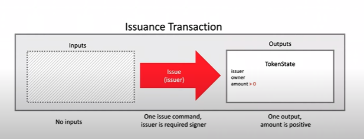
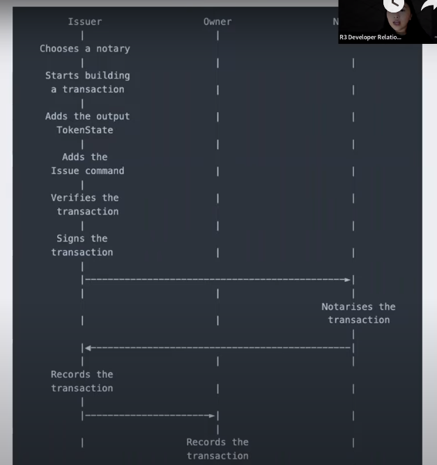
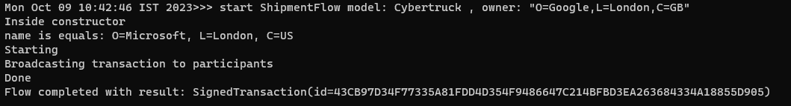
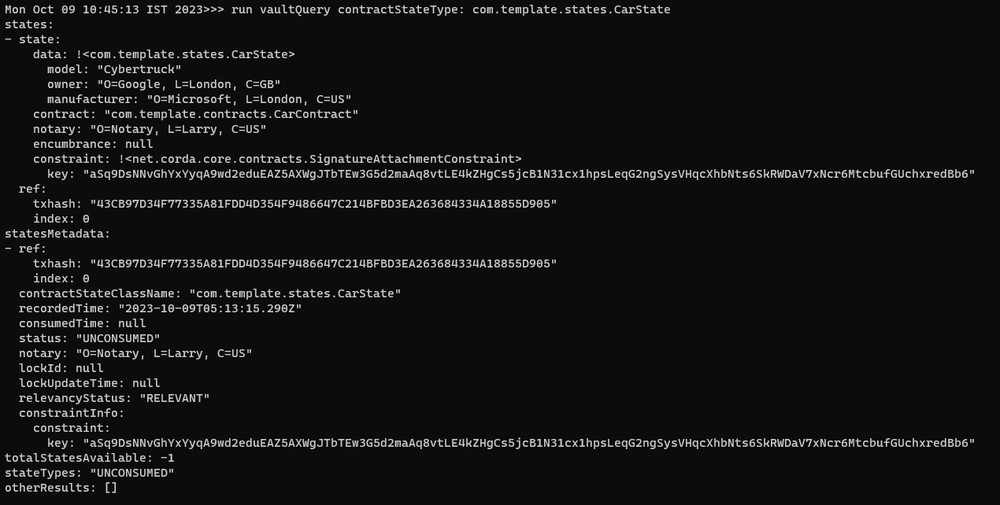

# CorDapp Token App - Java

## Components

### 1. Create TokenState
	
- Am immutable object representing a fact known on the ledger
- Token state will define a token
- TokenState should include an issuer(party), an owner(party), as well as an amount(Integer) attribute
  - TokenState implements ContractState
    - Party Issuer
    - Party Owner
    - int amount

### 2. Create TokenContract

- For a transaction to b verified, it must pass all rules set in the contract
  - TokenContract will define how TokenStakes evolved
    
  - TokenContract.java
  - public void verify(LedgerTransaction tx)
    - No input states
    - One output state
    - One command
    - Output must be TokenState
    - Output TokenState amount > 0
    - Command must be issue
    - Issuer is required Signer

### 3. Create TokenIssueFlow

- Flows automate the process of updating the ledger
  - Includes the Initiator flow (Issuer) and the Responder Flow (Owner)
    
    - Inside SignedTransaction Function (Initiator Flow)
      - Choose the notary 
      - Create our TokenState to represent on-ledger tokens!
      - Build our token issuance transaction to update the ledger!
      - Verify Txion builder
      - sign the transaction with our private key
      - The counterparty signs the transaction 
        - Return the signed transaction(Responder)
        - Stored the transaction into data base 
      - Received fully signed txion
      - transaction notarised and recorded

### 4. Build, run and interact with nodes
  - Build: gradlew.bat build deployNodes
  - Start: build\nodes\runnodes.bat
  - Interact with the nodes in terminal

# SHIPMENT FLOW
In microsoft node: start ShipmentFlow model: Cybertruck , owner: "O=Google,L=London,C=GB"

In google node: 
Received Shipment

run vaultQuery contractStateType: com.template.states.CarState

- 