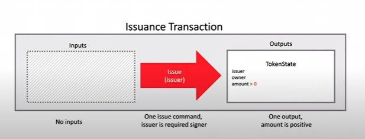
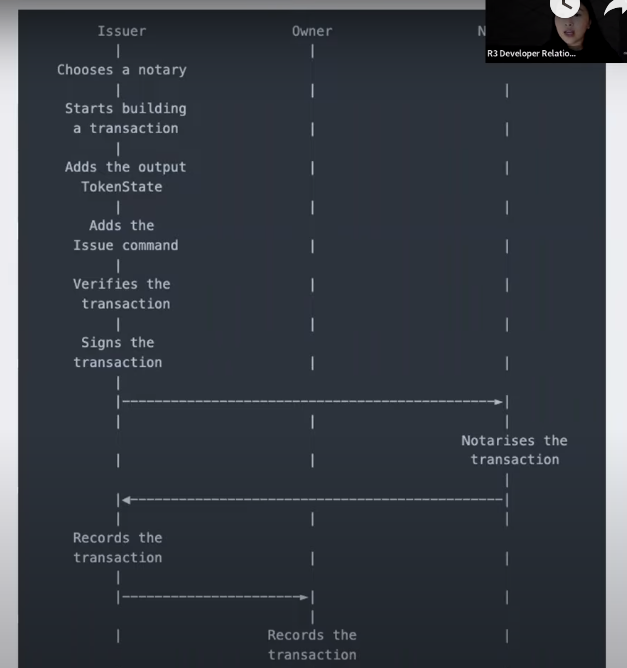
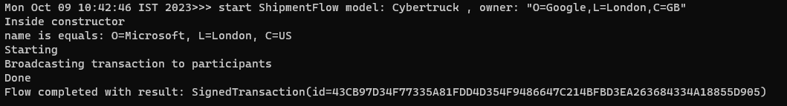
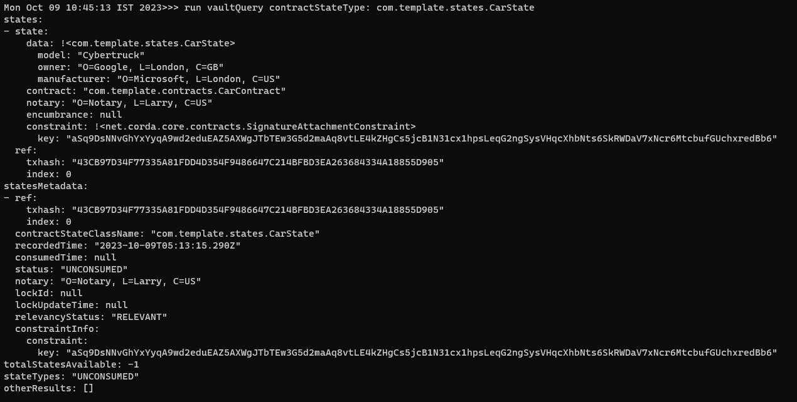

# 🚗 Automobile CorDapp — Corda Blockchain


A CorDapp (Corda Distributed Application) implementing automobile shipment tracking and token issuance on the Corda enterprise blockchain. Demonstrates Corda's peer-to-peer ledger model — states, contracts, and flows — for asset transfer between permissioned network participants.

---

## Architecture

| Component | Description |
|---|---|
| States | Immutable ledger facts — `TokenState` (issuer, owner, amount) · `CarState` (automobile asset) |
| Contracts | Verification logic — rules enforced on every transaction before ledger update |
| Flows | Automated ledger update sequences — Initiator + Responder pattern |
| Nodes | Permissioned network participants — Microsoft node (issuer) · Google node (owner) |

---

## Key components

### TokenState
- Implements `ContractState`
- Fields: `Party issuer` · `Party owner` · `int amount`
- Immutable — represents a tokenized fact on the shared ledger


### TokenContract
- Implements `verify(LedgerTransaction tx)`
- Enforces: no input states · one output state · one command · output must be `TokenState` · amount > 0 · command must be `Issue` · issuer is required signer




### TokenIssueFlow
- Selects notary
- Builds and verifies transaction
- Signs with issuer's private key
- Collects counterparty signature
- Notarises and records to both parties' vaults



### ShipmentFlow
- Transfers `CarState` between permissioned nodes
- Initiator proposes shipment · Responder signs and stores
- State queryable via `vaultQuery`

---

## Project structure
```
cordapp_automobile/
├── contracts/          # States and contract verification logic
├── workflows/          # Initiator and Responder flows
├── clients/            # RPC client for node interaction
├── config/             # Network node configuration
└── .ci/                # CI pipeline config

```

## Setup & run

```bash
# Build and deploy nodes
./gradlew build deployNodes

# Start nodes (Windows)
build\nodes\runnodes.bat

# Start nodes (Mac/Linux)
build/nodes/runnodes
```

---

## Interacting with nodes

### Initiate shipment — Microsoft node
```bash
start ShipmentFlow model: Cybertruck, owner: "O=Google,L=London,C=GB"
```



### Query received state — Google node
```bash
run vaultQuery contractStateType: com.template.states.CarState
```



### Issue tokens
```bash
start TokenIssueFlow owner: "O=Google,L=London,C=GB", amount: 100
```

---

## Built by

[Monicka Akilan](https://github.com/monickark) — Blockchain Architect · Smart Contract Engineer
[](https://www.linkedin.com/in/monickark/)
